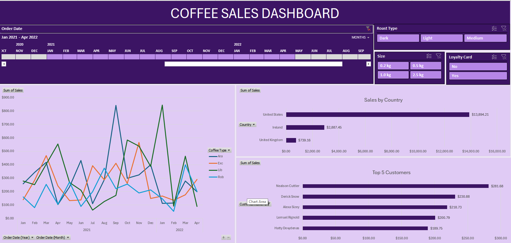

# Coffee Sales Dashboard

## Executive Summary

The Coffee Sales Dashboard is an interactive and data-driven visualization tool designed to track and analyze coffee sales over time. It provides insights into key performance metrics, customer behavior, and regional sales trends, enabling stakeholders to make informed business decisions. The dashboard consolidates sales data from **January 2021 to April 2022** and presents it in an easy-to-understand format using various interactive filters and graphical representations.

## Objectives

The primary objectives of the Coffee Sales Dashboard are:

1. **Monitor Sales Performance** – Track revenue trends across different time periods.
2. **Analyze Customer Behavior** – Identify top customers and their purchasing patterns.
3. **Assess Product Performance** – Evaluate the popularity of different coffee types and sizes.
4. **Geographical Sales Insights** – Determine which countries contribute most to revenue.
5. **Optimize Business Strategy** – Use data insights to enhance marketing, inventory, and pricing strategies.

## Key Features & Metrics

### 1. Sales Trends Over Time
- A **line chart** visualizes monthly sales data, showing fluctuations and seasonal trends.
- Different **coffee types (Ara, Exc, Lib, Rob)** are color-coded for better comparison.
- Data spans from **January 2021 to April 2022**, allowing historical trend analysis.

### 2. Sales by Country
- A **horizontal bar chart** displays revenue from different countries.
- The **United States** is the dominant market with **$13,894.21** in sales.
- **Ireland ($2,887.45)** and the **United Kingdom ($739.16)** are secondary markets.
- The **filtering option** allows drilling down into specific regions.

### 3. Top 5 Customers
- A **bar chart ranks** the five highest-spending customers.
- **Nealson Cuttler ($281.68)** is the top customer, followed by **Derick Snow ($230.88)** and **Alexa Sizey ($218.73)**.
- This helps in identifying loyal customers for targeted promotions and loyalty rewards.

### 4. Product Segmentation & Filters
- **Roast Type:** Sales data can be filtered by **Dark, Light, and Medium roasts**.
- **Size Variants:** Customers can purchase in **0.2 kg, 0.5 kg, 1.0 kg, and 2.5 kg** sizes.
- **Loyalty Card Status:** Analysis of purchases based on loyalty program membership.

### 5. Date Selection & Customization
- Users can select specific timeframes (**monthly, quarterly, yearly**) for a focused view.
- **Order Date filter** enables precise trend analysis across different periods.

## Key Insights & Business Implications

1. **Strong US Market Dominance**
   - The United States contributes the highest sales revenue, indicating a strong consumer base.
   - This suggests a need for market expansion strategies in Ireland and the UK.

2. **Seasonal Sales Fluctuations**
   - Sales exhibit peaks and troughs, possibly due to seasonal demand or promotional events.
   - A **seasonal marketing strategy** (holiday discounts, bundle offers) could help maximize revenue.

3. **Customer Retention Strategy**
   - The **top customers account for a significant portion of sales**.
   - Implementing **loyalty programs, personalized offers, and customer engagement initiatives** can help retain high-value customers.

4. **Product Performance Analysis**
   - Different coffee types exhibit varying sales trends, indicating customer preferences.
   - Understanding **which roast type and sizes sell best** can optimize inventory management and pricing.

5. **Potential for Growth in Secondary Markets**
   - Sales in **Ireland and the UK** show potential but remain lower than in the US.
   - Localized marketing campaigns and partnerships could boost sales in these regions.
