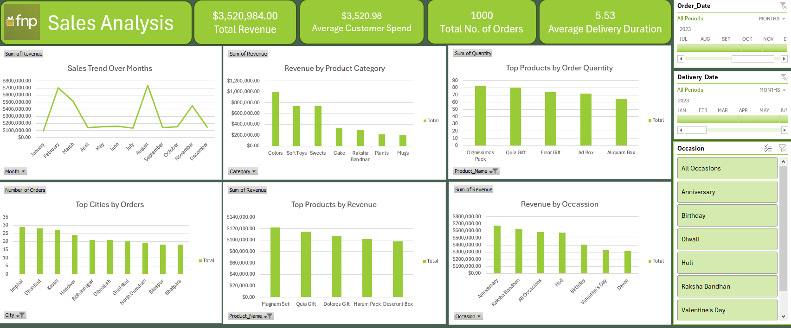

# FnP Sales Analysis Dashboard

##  Project Overview
The Sales Analysis Dashboard provides an insightful overview of sales performance, customer behavior, and revenue distribution across various dimensions. The dashboard enables data-driven decision-making by offering key metrics such as total revenue, order volume, customer spending, and delivery duration. The interactive visualizations allow stakeholders to filter and analyze sales trends based on occasion, product category, time, and location.

## Features
- **Revenue Insights**: Analyze sales performance by occasion, product category, and region.
- **Top-Selling Products**: Identify high-demand items to optimize inventory management.
- **Geographical Sales Analysis**: Understand market trends across different cities.
- **Seasonal Trends**: Discover peak sales months and optimize marketing campaigns.
- **Customer Behavior Analysis**: Track purchase trends based on order timing.

## Key Performance Indicators (KPIs)
- **Total Revenue:** $3,520,984
- **Total Orders:** 1,000
- **Average Delivery Duration:** 5.53 days
- **Average Customer Spending:** $3,520.98

##  Insights & Findings
### **1. Revenue by Occasion**
- **Top Performers:** Anniversary, Raksha Bandhan, Holi ($500K+ revenue each).
- **Low Performers:** Diwali, Valentine’s Day ($400K and below).
- **Strategy:** Increase promotional efforts for low-performing occasions.

### **2. Revenue by Product Category**
- **Best Sellers:** Colors ($1.2M+), Soft Toys, Sweets.
- **Low Sales:** Mugs, Plants, Cakes.
- **Strategy:** Introduce combo deals, discounts, and new variations.

### **3. Geographic Sales Performance**
- **Top Cities:** Imphal, Dhanbad, Kavai, Haridwar, Bhavnagar.
- **Strategy:** Run localized campaigns and optimize delivery in high-sales areas.

### **4. Sales Trends by Month**
- **Peak Months:** March & October ($700K+ revenue each).
- **Slow Periods:** April, May, July, September.
- **Strategy:** Introduce off-season discounts and loyalty programs.

### **5. Customer Behavior (Order Time Analysis)**
- **Peak Hours:** 7 AM - 10 AM and 7 PM - 10 PM.
- **Strategy:** Run targeted promotions and flash sales during peak hours.

## Recommendations
### **1. Boost Off-Peak Sales**
Introduce promotions or discounts during April and May to increase revenue in traditionally slow months.
### **2. Increase Engagement for Low-Performing Occasions** 
Target campaigns for Valentine's Day and Diwali to improve revenue contributions.
### **3. Expand High-Demand Products** 
Invest in the production and marketing of top-performing products like Colors, Soft Toys, and Sweets.
### **4. Location-Based Marketing** 
Focus advertising efforts on high-order cities while exploring growth opportunities in underperforming regions.
### **5. Optimize Order Time Strategy** 
Run special deals or flash sales around peak order hours (morning and late evening) to maximize customer engagement.
